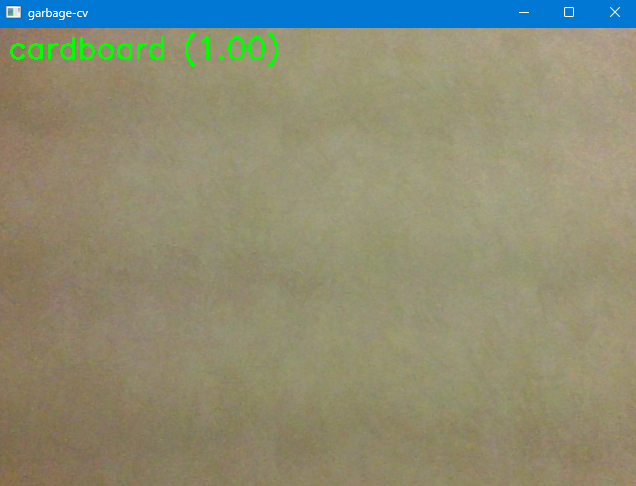
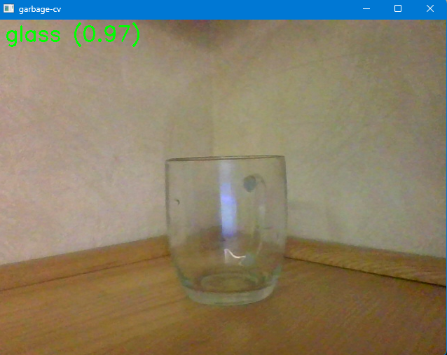
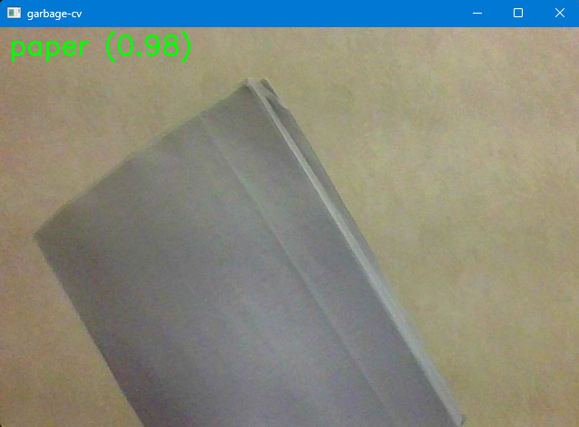
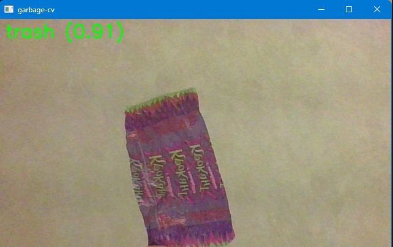

# Garbage Classification ML Pipeline


<p align="center">
  
  <br>
  
  
</p>


[](https://www.python.org/)
[](https://www.tensorflow.org/)

## 🧠 About the Project

**Garbage Classification ML Pipeline** is a Python-based deep learning system for classifying waste images into categories like plastic, metal, paper, glass, and more. Built using TensorFlow and MobileNetV2, it supports smart recycling, environmental AI, educational use, and rapid prototyping.

> **Dataset:** Based on the [Garbage Classification v2 dataset from Kaggle](https://www.kaggle.com/datasets/sumn2u/garbage-classification-v2).

This pipeline includes end-to-end tools for dataset prep, training, evaluation, and inference — all configurable through the command line.

---

## 🔍 Features

- 🗑️ Multi-class garbage classification using transfer learning
- ⚡ Fast training with MobileNetV2 backbone
- 📊 Auto class weighting to handle imbalances
- 💾 Dataset caching for speed and reproducibility
- 🧪 Evaluation tools: confusion matrix, classification report
- 📸 Single image prediction via CLI
- 🧩 Modular codebase for reuse and extension
- 📦 Includes example scripts and assets

---

## 🧠 Use Cases

- Smart recycling in IoT or embedded systems  
- Environmental data classification for research  
- Educational demos of CNN transfer learning  
- Base architecture for new image classification tasks  

---

## ⚙️ How It Works

1. **Data Prep:** Organize images into folders per class.
2. **Dataset Splitting:** `dataset_prep.py` splits data into train/val/test and generates class stats.
3. **Training:** `train.py` trains a MobileNetV2 model with freezing + fine-tuning phases.
4. **Evaluation:** Test performance using `test.py` or `eval.py`.
5. **Inference:** Predict class of a single image using trained model.

---

## 🗂️ Project Structure

```
train.py              # Model training and inference
test.py               # Test set evaluation
dataset\_prep.py       # Data split + caching
eval.py               # Metrics + confusion matrix
webcam\_demo.py        # Real-time inference (optional)
data\_raw/             # Original unsplit dataset
data\_splits/          # Preprocessed dataset splits
eval\_192/             # Example evaluation outputs
out\_192.keras         # Trained model checkpoint

```

---

## 🚀 Getting Started

### 1. Prepare Dataset

Place class-organized images into `ml/data_raw/`:

```

ml/data\_raw/
├── plastic/
├── paper/
├── glass/
└── metal/

````

Then run:

```bash
python ml/dataset_prep.py --input-dir ml/data_raw --output-dir ml/data_splits
````

### 2. Install Dependencies

```bash
pip install tensorflow opencv-python numpy
```

> Optionally add `matplotlib`, `scikit-learn`, or `pandas` for evaluation visuals.

---

### 3. Train the Model

Example command for 192x192 image size:

```bash
python ml/train.py --data-root ml/data_splits --img-size 192 192 --batch 96 \
  --freeze-epochs 1 --ft-epochs 6 --lr 1e-3 --ft-lr 5e-5 --unfreeze-layers 40 \
  --model ml/out_192.keras
```

---

### 4. Evaluate the Model

```bash
python ml/test.py --data-root ml/data_splits --model ml/out_192.keras
```

Or generate detailed metrics and plots:

```bash
python ml/eval.py --data-root ml/data_splits --model ml/out_192.keras --output-dir ml/eval_192
```

---

### 5. Predict a Single Image

```bash
python ml/train.py --predict "path/to/image.jpg" \
  --model ml/out_192.keras \
  --class-names ml/data_splits/class_names.txt \
  --img-size 192 192
```

---

## 💡 Example CLI Usage

**Train:**

```bash
python ml/train.py --data-root ml/data_splits --img-size 192 192 --batch 96 \
--freeze-epochs 1 --ft-epochs 6 --lr 1e-3 --ft-lr 5e-5 --unfreeze-layers 40 \
--model ml/out_192.keras
```

**Predict:**

```bash
python ml/train.py --predict "sample.jpg" --model ml/out_192.keras \
--class-names ml/data_splits/class_names.txt --img-size 192 192
```

---

## 🙏 Acknowledgments

* Built using [TensorFlow](https://www.tensorflow.org/) and [Keras](https://keras.io/)
* Dataset from [Garbage Classification v2 on Kaggle](https://www.kaggle.com/datasets/sumn2u/garbage-classification-v2)

---

*Explore the inline code comments for full pipeline details.*
